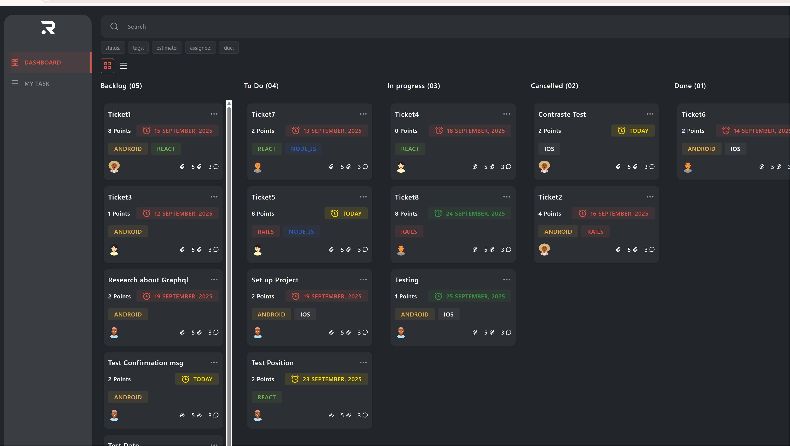
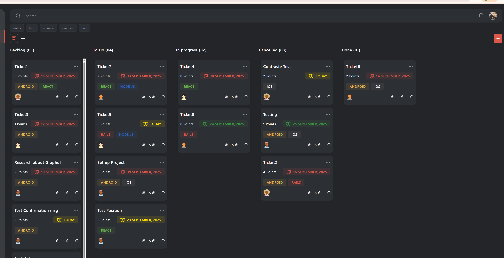

# Task Management Challenge

Task management application that allows you to browse, create, update, and delete tasks for different users using a GraphQL API.

## Description

The goal is to implement a **Task Management Dashboard** with the following features:

- View tasks grouped by status.
- Create new tasks using a modal.
- Edit and delete existing tasks.
- Filter and search tasks.
- Display user profile information.

## Installation & Running

### Prerequisites

- Node.js >= 22.19
- yarn

### Installation

```bash
git clone https://github.com/marjo1994/easy-life-task-manager
cd easy-life-task-manager
yarn
```

## Technologies

- React
- Apollo Client (GraphQL)
- TailwindCSS
- React Hook Form
- Zod
- Headless UI
- Dnd Kit
- Zustand

## Structure

```src/
├── components/ # UI components : Atomic Design Pattern (Atoms, Molecules, Organisms/ Pages)
├── _generated_/ # Generated types by Codegen
├── graphql/ # Queries & mutations
├── hooks/ # Custom React hooks
├── schemas/ # Zod validation
├── store/ # Using Zustand, searchStore.ts
├── utils/ # Utility functions, helpers, constants
└── index.css/ # Global Styles: Colors, typography, etc.
```

## Features

- Dashboard with Sidebar, Header, and task columns.
- Task cards with name, tags, due date, points, and avatar.
- Create, edit, and delete tasks.
- Loading, error, and empty states.
- Filters and search.
- Profile page with user information.

## Design

- Official Figma: [Design](https://www.figma.com/design/iMJq3KKgwfKLwgrpmJSId9/Task-Management-Challenge?node-id=121-4250&t=jsTskXKpOWVeS3rk-0)
- System fonts for cross-platform consistency.
- Colors and spacing follow the design system.
- Reusable and consistent components.

## Bonus

- Drag & drop tasks between columns. (Desktop)
- Change of position between cards. (Desktop)
- Task counters per column.
- Alternative list view.
- Due dates color-coded by urgency.

## Live DEMO

https://easy-life-task-manager.vercel.app/

# Feature: Drag and Drop



# Feature: Filter


